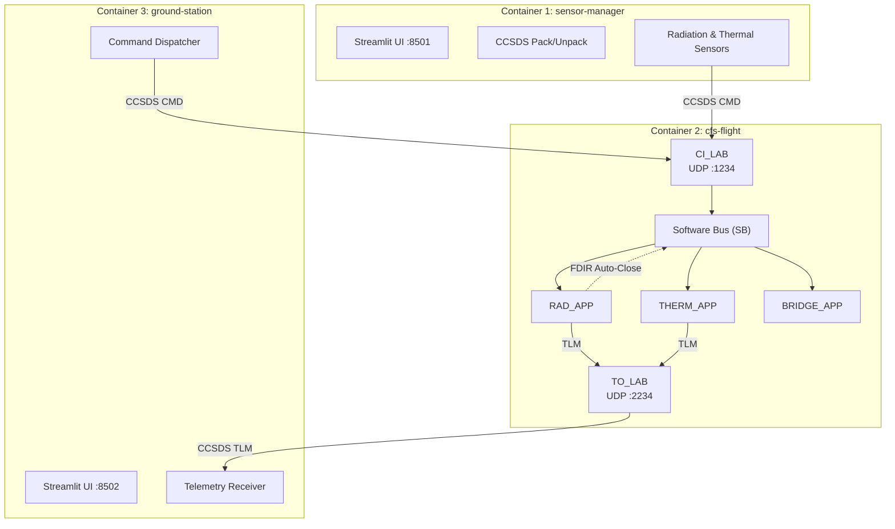

# NASA cFS & Python CCSDS Bridge

High-Fidelity Spacecraft Software Integration Project

## Overview

This project establishes a bidirectional communication bridge between NASA's Core Flight System (cFS) and a Python-based Sensor Manager and Ground Station (MOC). The Sensor Manager acts as an environment simulator, injecting simulated sensor readings (radiation, thermal) into the cFS firmware. The Ground Station provides real-time telemetry monitoring, event logging, and operator command dispatch. All communication uses the industry-standard CCSDS (Consultative Committee for Space Data Systems) Space Packet Protocol.

## System Architecture

### 1. On-Board Segment (NASA cFS)

- Runs within a privileged Linux Docker container.
- Utilizes the Software Bus (SB) for internal message routing.
- CI_LAB ingests CCSDS command packets from external UDP sources (port 1234).
- RAD_APP monitors radiation levels and triggers autonomous Solar Array Close via FDIR.
- THERM_APP monitors temperature and logs CRITICAL events.
- BRIDGE_APP demonstrates SB fan-out delivery by logging all packets on MID 0x1882.
- TO_LAB forwards processed telemetry out via UDP (port 2234).

### 2. Sensor Manager (Python / Streamlit)

- An extensible Python framework for simulating spacecraft environment sensors.
- Streamlit-based UI (port 8501) for real-time sensor value injection.
- Plugin architecture: drop a new sensor class into `sensors/` and it auto-discovers.
- Uses `struct` for binary serialization of CCSDS headers and IEEE 754 float payloads.

### 3. Ground Station / MOC (Python / Streamlit)

- Mission Operations Center with real-time telemetry visualization (port 8502).
- `CommandDispatcher` sends CCSDS command packets to cFS via UDP.
- `TelemetryReceiver` listens on UDP 2234 for downlinked telemetry from TO_LAB.
- `TelemetryProcessor` aggregates data into time-series for charting and event logs.
- Operator can manually override FDIR actions (e.g., open solar array despite high radiation).
- Modular command definitions in `commands/` and telemetry processing in `telemetry/`.

### 4. Transport Layer

- Protocol: UDP (User Datagram Protocol).
- Data Format: CCSDS Space Packet (Primary Header + Secondary Header + Payload).
- Commands: 6-byte primary + 2-byte command secondary (FC + checksum) + payload = **8+ bytes**.
- Telemetry (cFS Draco): 6-byte primary + 6-byte telemetry secondary (timestamp) + 4-byte spare pad + payload = **16+ bytes**.
- Command floats: Big-Endian (`struct.pack("!f", value)`).
- Telemetry floats from cFS: Little-Endian (`struct.unpack("<f", ...)`) — host byte order on x86.

## Technical Specifications

### Network Configuration

| Service              | Port   | Protocol | Description                              |
|----------------------|--------|----------|------------------------------------------|
| cFS Command Ingest   | 1234   | UDP      | Sensor/command data sent to cFS CI_LAB   |
| cFS Telemetry Out    | 2234   | UDP      | Processed telemetry from cFS TO_LAB      |
| Sensor Manager UI    | 8501   | TCP      | Streamlit environment simulator          |
| Ground Station UI    | 8502   | TCP      | Streamlit mission operations center      |

### Message Map

| MID      | Type | Application     | Direction | Description                       |
|----------|------|-----------------|-----------|-----------------------------------|
| `0x1882` | CMD  | RAD_APP         | Incoming  | Radiation sensor data             |
| `0x1883` | CMD  | THERM_APP       | Incoming  | Thermal sensor data               |
| `0x1890` | CMD  | SOLAR_ARRAY_APP | Outgoing  | Solar array drive commands        |
| `0x0882` | TLM  | RAD_APP         | Outgoing  | Processed radiation telemetry     |
| `0x0883` | TLM  | THERM_APP       | Outgoing  | Processed thermal telemetry       |
| `0x0880` | TLM  | TO_LAB          | Outgoing  | Housekeeping telemetry            |
| `0x0808` | TLM  | CFE_EVS         | Outgoing  | Event messages (long format)      |

### Function Codes

| FC  | Name               | Description                        |
|-----|--------------------|------------------------------------|
| `0` | NOOP               | No-operation heartbeat             |
| `1` | RESET              | Reset application counters         |
| `2` | SEND_DATA          | Inject sensor reading              |
| `5` | SOLAR_ARRAY_OPEN   | Manual solar array open            |
| `6` | SOLAR_ARRAY_CLOSE  | Close solar array (FDIR or manual) |

### Tech Stack

- Core: NASA cFS (Core Flight Executive, OSAL, PSP).
- Language: C (Flight Software) & Python 3.10+ (Sensor Manager, Ground Station).
- DevOps: Docker & Docker Compose for 3-container orchestration.
- UI: Streamlit for real-time simulation and mission operations.
- Communication: BSD Sockets & CCSDS Space Packet Protocol v1.
- Testing: pytest with 98% coverage on ground station, 76+ sensor manager tests.

### Key Goals

- [x] Containerization: Successfully compile and run cFS inside a Docker environment.
- [x] Binary Packing: Build a Python utility to generate valid 48-bit CCSDS headers.
- [x] Software Bus Integration: Verify that a packet sent from Python is received and logged by cFS.
- [x] Sensor Manager Framework: Extensible sensor simulation with Streamlit UI and auto-discovery.
- [x] FDIR Processing: Autonomous fault detection with Solar Array Close on high radiation.
- [x] Telemetry Feedback: Receive processed telemetry from cFS and display in Ground Station.
- [x] Ground Station (MOC): Real-time telemetry charts, command dispatch, and live event logs.
- [x] Operator Override: Manual commands from Ground Station override autonomous FDIR actions.
- [x] Full System Integration: End-to-end verification across all three containers.

---

Developed as an engineering project to explore the intersection of Aerospace Engineering and Modern Software Development.

---
