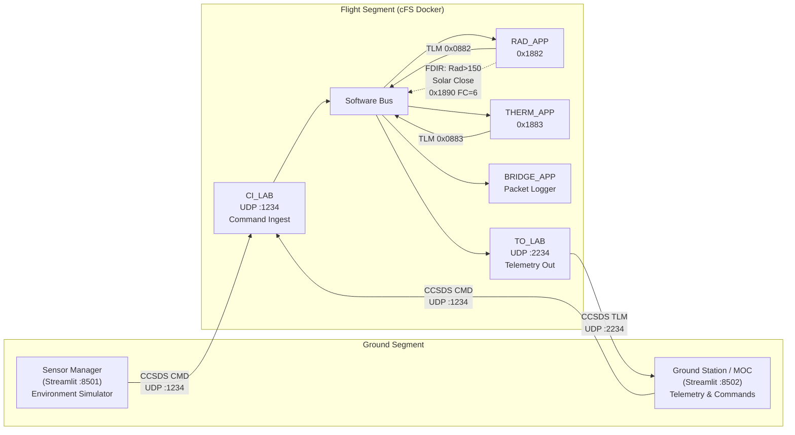

# CFS-Bridge

A high-fidelity satellite software integration project bridging NASA's Core Flight System (cFS) with a Python-based Sensor Manager and Ground Station (MOC) using the CCSDS Space Packet Protocol over UDP.

## System Architecture



```
 Sensor Manager         Flight Software (cFS)                   Ground Station
+-----------------+     +--------------------------------------+ +--------------------+
|                 | CMD |                                      | |                    |
| Radiation Sim   |---->| CI_LAB (UDP :1234)                   | | Telemetry Charts   |
| Thermal Sim     |     |    |                                 | |  - Radiation       |
|                 |     |    v  Software Bus                   | |  - Temperature     |
| Streamlit UI    |     |  RAD_APP    THERM_APP   BRIDGE_APP   | |                    |
| :8501           |     |  (0x1882)  (0x1883)    (logger)      | | Command Center     |
|                 |     |    |           |                     | |  - Array Open/Close|
+-----------------+     |    | FDIR      | FDIR                | |                    |
                        |    v           v                     | | Live Logs          |
                        |  Solar       EVS Event               | |  - Raw TLM hex     |
                        |  Close Cmd   Log                     | |  - EVS events      |
                        |  (0x1890)    (>100 C)                | |                    |
                        |                                      | | Streamlit UI       |
                        |  TO_LAB -----> TLM (0x0882, 0x0883) |-->  :8502             |
                        |  (UDP :2234)                         | |                    |
                        +--------------------------------------+ +--------------------+
```

### Three-Container Architecture

| Container        | Role                          | Port(s)          | Technology         |
|------------------|-------------------------------|------------------|--------------------|
| `cfs-flight`     | Flight Software (cFS)         | `1234/udp` (CMD) | C, NASA cFS        |
| `sensor-manager` | Environment Simulator         | `8501` (UI)      | Python, Streamlit  |
| `ground-station` | Mission Operations Center     | `8502` (UI), `2234/udp` (TLM) | Python, Streamlit |

### Communication Flow

1. **Sensor Simulation (Python -> cFS):** The Sensor Manager packs sensor readings into CCSDS command packets and sends via UDP to CI_LAB on port **1234**
2. **Software Bus Fan-out:** CI_LAB publishes to the cFS Software Bus. RAD_APP, THERM_APP, and BRIDGE_APP receive commands routed by MID
3. **FDIR Processing:** RAD_APP and THERM_APP extract the float payload, evaluate FDIR rules, and take autonomous action
4. **Telemetry Downlink (cFS -> Ground Station):** TO_LAB forwards processed telemetry to the Ground Station on port **2234**
5. **Ground Station Display:** Real-time charts, event logs, and operator command dispatch

### FDIR Rules

| Application | Threshold | Action |
|-------------|-----------|--------|
| RAD_APP | Radiation > 150.0 mSv/h | Publish Solar Array Close command (MID `0x1890`, FC `6`) |
| THERM_APP | Temperature > 100.0 C | Log CRITICAL event via `CFE_EVS_SendEvent` |

## Message Map

### Message IDs (MIDs)

| Application     | MID      | Type | Direction | Description                       |
|-----------------|----------|------|-----------|-----------------------------------|
| RAD_APP         | `0x1882` | CMD  | Incoming  | Radiation sensor data             |
| THERM_APP       | `0x1883` | CMD  | Incoming  | Thermal sensor data               |
| SOLAR_ARRAY_APP | `0x1890` | CMD  | Outgoing  | Solar array drive commands        |
| RAD_APP         | `0x0882` | TLM  | Outgoing  | Processed radiation telemetry     |
| THERM_APP       | `0x0883` | TLM  | Outgoing  | Processed thermal telemetry       |
| TO_LAB          | `0x0880` | TLM  | Outgoing  | Housekeeping telemetry            |
| CFE_EVS         | `0x0808` | TLM  | Outgoing  | Event messages (long format)      |

### Function Codes (FCs)

| Code | Name               | Used By                    | Description                    |
|------|--------------------|----------------------------|--------------------------------|
| `0`  | NOOP               | All apps                   | No-operation (heartbeat)       |
| `1`  | RESET              | All apps                   | Reset counters                 |
| `2`  | SEND_DATA          | RAD_APP, THERM_APP         | Inject sensor reading          |
| `5`  | SOLAR_ARRAY_OPEN   | SOLAR_ARRAY_APP            | Manual open (operator)         |
| `6`  | SOLAR_ARRAY_CLOSE  | SOLAR_ARRAY_APP            | Close (FDIR or manual)         |

### CCSDS Packet Structure

#### Primary Header (6 bytes, Big-Endian)

| Word     | Bits | Fields                                      |
|----------|------|---------------------------------------------|
| StreamId | 16   | Version(3), Type(1), SecHdrFlag(1), APID(11) |
| Sequence | 16   | SeqFlags(2), SeqCount(14)                    |
| Length   | 16   | TotalPacketBytes - 7                         |

#### Command Packet Layout (8+ bytes)

```
[Primary Header: 6 bytes] [Cmd SecHdr: 2 bytes] [Payload: variable]
 StreamId(16)              FuncCode(8)           Big-Endian float
 Sequence(16)              Checksum(8)
 Length(16)
```

#### Telemetry Packet Layout — cFS Draco (16+ bytes)

```
[Primary: 6 bytes] [TLM SecHdr: 6 bytes] [Spare: 4 bytes] [Payload: variable]
 StreamId(16)       Seconds(32)            0x00000000        LE float + health byte
 Sequence(16)       Subseconds(16)
 Length(16)
```

The 4-byte `Spare[4]` pad is part of the cFS Draco `CFE_MSG_TelemetryHeader_t` for 64-bit alignment.
RAD/THERM telemetry packets are 24 bytes total (16-byte header + 4 float + 1 health + 3 pad).

#### Byte Ordering

| Context | Byte Order | Python `struct` |
|---------|-----------|-----------------|
| CCSDS headers | Big-Endian | `!H` / `!I` |
| Command payloads (Python → cFS) | Big-Endian | `struct.pack("!f", value)` |
| Telemetry payloads (cFS → Python) | Little-Endian | `struct.unpack("<f", data)` |

### UDP Port Map

| Port   | Direction           | Protocol | Purpose                        |
|--------|---------------------|----------|--------------------------------|
| `1234` | Python -> cFS       | UDP      | CI_LAB command ingest          |
| `2234` | cFS -> Ground Station | UDP    | TO_LAB telemetry output        |
| `8501` | Browser -> Python   | TCP      | Sensor Manager UI              |
| `8502` | Browser -> Python   | TCP      | Ground Station UI              |

## Repository Structure

```
cfs-bridge/
  docker-compose.yml              # Orchestrates all 3 containers
  pyproject.toml                  # Pytest config & project metadata
  Makefile                        # Build, test, coverage, start-mission
  run_mission.sh                  # Full mission orchestration script
  integration_suite.py            # End-to-end system verification
  check_integration.sh            # Legacy integration verification script
  firmware/
    Dockerfile                    # Builds cFS on Ubuntu 22.04
    apps/
      bridge_app/                 # cFS packet logger (subscribes to 0x1882)
      rad_app/                    # Radiation monitor + FDIR
      therm_app/                  # Thermal monitor + FDIR
    defs/                         # Mission config overlays
      targets.cmake               # Defines all apps in the mission build
      cpu1_cfe_es_startup.scr     # Application startup sequence
    patches/
      to_lab_sub.c                # TO_LAB subscription table
    cFS/                          # NASA cFS submodule (unchanged)
  sensor_manager/
    Dockerfile                    # Python 3.10 + Streamlit container
    requirements.txt              # pytest + streamlit
    manager_app.py                # Streamlit UI for sensor simulation
    core/
      ccsds_utils.py              # CCSDS packet pack/unpack utilities
      mission_registry.py         # Single source of truth for MIDs & FCs
      base_sensor.py              # Abstract BaseSensor class
    sensors/
      radiation_sensor.py         # Radiation environment sensor
      thermal_sensor.py           # Thermal sensor
    tests/                        # 76 unit tests
  ground_station/
    Dockerfile                    # Python 3.10 + Streamlit container
    requirements.txt              # pytest + streamlit + pandas
    ground_app.py                 # Streamlit MOC dashboard
    command_dispatcher.py         # Sends CCSDS commands via UDP
    telemetry_receiver.py         # Listens for telemetry on UDP 2234
    commands/
      solar_array.py              # Solar array command definitions
    telemetry/
      processor.py                # Telemetry aggregation & event tracking
    tests/                        # 73 unit tests (98% coverage)
```

## Prerequisites

- Docker & Docker Compose
- Python 3.10+ (for running tests locally)

## Quick Start

### Using the Makefile

```bash
make build           # Build all Docker containers
make test            # Run all unit tests
make coverage        # Run tests with coverage report
make start-mission   # Build and start all services
make stop            # Stop all services
make integration     # Run integration verification
make clean           # Stop and remove images
```

### Using run_mission.sh

```bash
./run_mission.sh                  # Build, test, and start
./run_mission.sh --skip-tests     # Build and start (skip tests)
./run_mission.sh --integration    # Build, test, start, and verify
./run_mission.sh --stop           # Stop all services
./run_mission.sh --clean          # Stop and remove images
```

### Manual Steps

```bash
# 1. Build
docker compose build

# 2. Start
docker compose up -d

# 3. Open UIs
#    Sensor Manager:  http://localhost:8501
#    Ground Station:  http://localhost:8502

# 4. Verify
docker logs cfs-flight 2>&1 | grep -E "(BRIDGE_APP|RAD_APP|THERM_APP).*Initialized"

# 5. Run tests
python -m pytest sensor_manager/tests/ ground_station/tests/ -v

# 6. Run integration
python integration_suite.py

# 7. Stop
docker compose down
```

## Operator Guide

### Sensor Manager (Environment Simulator) — Port 8501

The Sensor Manager simulates the spacecraft environment. Use it to inject sensor readings into the flight software.

1. Open [http://localhost:8501](http://localhost:8501)
2. Adjust the **Radiation** slider (0-1000 rad) and click **Send Radiation Sensor**
3. Adjust the **Temperature** slider (-40-85 C) and click **Send Thermal Sensor**
4. Watch cFS logs: `docker logs -f cfs-flight`

**Testing FDIR:**
- Set Radiation > 150 mSv/h to trigger automatic Solar Array Close
- Set Temperature > 100 C to trigger a CRITICAL event log

### Ground Station (MOC) — Port 8502

The Ground Station is the mission operator's console. Use it to monitor telemetry and send commands.

1. Open [http://localhost:8502](http://localhost:8502)
2. **Telemetry Visuals:** Real-time line charts update as cFS sends processed telemetry
3. **Command Center:**
   - Click **Manual Solar Array Open** to override FDIR and open the array
   - Click **Manual Solar Array Close** to manually close the array
4. **Live Logs:** View raw telemetry hex and parsed EVS event messages
5. Enable **Auto-refresh** for continuous monitoring

## Developer Guide

### Adding a New Sensor

1. **Define the MID** in `sensor_manager/core/mission_registry.py`:
   ```python
   class MID:
       PRESSURE_APP = 0x1884  # New sensor app
   ```

2. **Create the sensor** in `sensor_manager/sensors/pressure_sensor.py`:
   ```python
   from sensor_manager.core.base_sensor import BaseSensor
   from sensor_manager.core.mission_registry import MID, FC

   class PressureSensor(BaseSensor):
       name = "Pressure Sensor"
       mid = MID.PRESSURE_APP
       func_code = FC.SEND_DATA
       unit = "hPa"
       min_value = 0.0
       max_value = 1100.0
       default = 1013.25
   ```

3. **Create the cFS app** in `firmware/apps/pres_app/` following the RAD_APP pattern
4. **Update mission config:** Add to `targets.cmake` and `cpu1_cfe_es_startup.scr`
5. **Update TO_LAB:** Add TLM MID to `patches/to_lab_sub.c`
6. The Streamlit UI **auto-discovers** the new sensor on next launch

### Adding a New cFS Application

1. Create the app directory: `firmware/apps/my_app/`
2. Follow the cFS app structure (see `rad_app/` as reference):
   ```
   my_app/
     CMakeLists.txt
     fsw/
       src/my_app.c
       inc/my_app.h
       platform_inc/my_app_msgids.h
   ```
3. Register in `firmware/defs/targets.cmake`:
   ```cmake
   list(APPEND MISSION_GLOBAL_APPLIST my_app)
   ```
4. Add startup entry in `firmware/defs/cpu1_cfe_es_startup.scr`
5. If the app produces telemetry, add its TLM MID to `firmware/patches/to_lab_sub.c`

### Adding a Ground Station Command

1. Create a new command module in `ground_station/commands/`:
   ```python
   from ground_station.command_dispatcher import CommandDispatcher
   from sensor_manager.core.mission_registry import MID, FC

   class MyCommands:
       def __init__(self, dispatcher: CommandDispatcher):
           self._dispatcher = dispatcher

       def do_something(self) -> int:
           return self._dispatcher.send(MID.MY_APP, FC.MY_CODE)
   ```
2. Add UI buttons in `ground_station/ground_app.py`

## cFS Applications

### RAD_APP (Radiation Monitor)

Subscribes to radiation sensor commands on MID `0x1882`. Extracts the float payload (Big-Endian from command), evaluates FDIR thresholds, and generates telemetry (Little-Endian floats in host byte order).

- **FDIR**: If radiation > 150.0 mSv/h, publishes a Solar Array Close command (MID `0x1890`, FC `6`)
- **Telemetry**: Sends processed radiation value + health status on MID `0x0882`
- **Health Codes**: `0` = NOMINAL, `1` = WARNING (> 100 mSv/h), `2` = CRITICAL (> 150 mSv/h)

### THERM_APP (Thermal Monitor)

Subscribes to thermal sensor commands on MID `0x1883`. Extracts the float payload (Big-Endian from command), evaluates FDIR thresholds, and generates telemetry (Little-Endian floats in host byte order).

- **FDIR**: If temperature > 100.0 C, logs a CRITICAL event via `CFE_EVS_SendEvent`
- **Telemetry**: Sends processed temperature value + health status on MID `0x0883`
- **Health Codes**: `0` = NOMINAL, `1` = WARNING (> 80 C), `2` = CRITICAL (> 100 C)

### BRIDGE_APP (Packet Logger)

Subscribes to MID `0x1882` and logs all received packets via `CFE_ES_WriteToSysLog`. Demonstrates SB fan-out delivery.

## Python CCSDS API

```python
from sensor_manager.core import pack_cmd_packet, unpack_tlm_packet, MID, FC
import struct

# Send a sensor data command
packet = pack_cmd_packet(mid=MID.RADIATION_APP, func_code=FC.SEND_DATA,
                         payload=struct.pack('!f', 123.45))

# Send a solar array command
from ground_station.commands.solar_array import SolarArrayCommands
from ground_station.command_dispatcher import CommandDispatcher
dispatcher = CommandDispatcher(host="localhost", port=1234)
solar = SolarArrayCommands(dispatcher)
solar.open_array()

# Unpack received telemetry
info = unpack_tlm_packet(raw_bytes)
print(f"APID={info['apid']:#05x} Time={info['seconds']}s")
```

## License

This project uses NASA cFS which is licensed under Apache 2.0.
